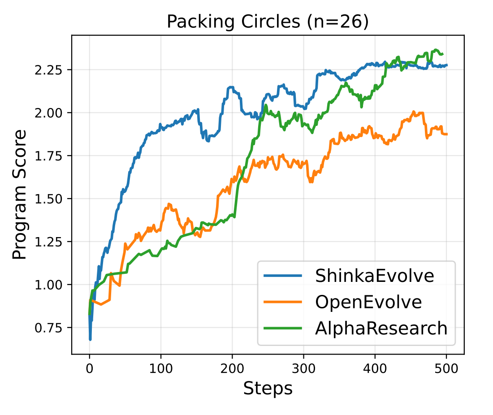
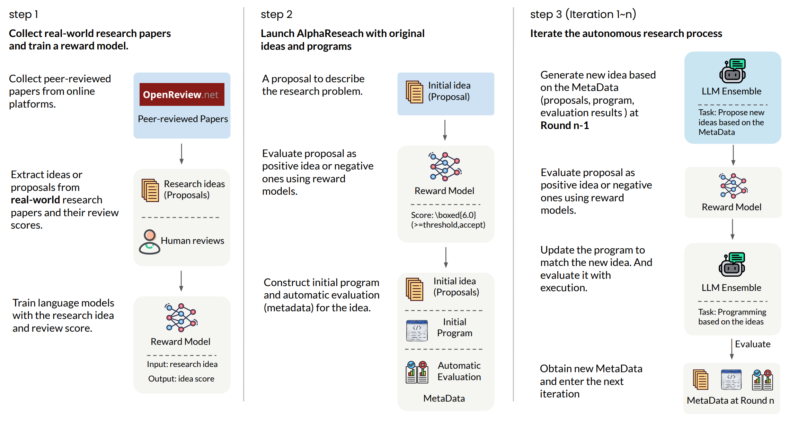

<h1 align="center">

<br>
Accelerating New Algorithm Discovery with Language Models 
</h1>

<p align="center">
  <a href=""><b>[🌐 Website]</b></a> •
  <a href="https://arxiv.org/abs/2511.08522"><b>[📜 Paper]</b></a> •
  <a href="https://huggingface.co/alpha-research"><b>[🤗 HF Models]</b></a> •
  <a href="https://github.com/answers111/alpha-research"><b>[🐱 GitHub]</b></a>
</p>
<p align="center">
Repo for "<a href="https://arxiv.org/abs/2511.08522" target="_blank">AlphaResearch: Accelerating New Algorithm Discovery with Language Models</a>"
</p>


<div align="center">


<br>
    <em>Figure 1: Comparison of OpenEvolve (with program-based reward), ShinkaEvolve (with programbased reward) and AlphaResearch (with program-based and peer-review reward). </em>
</div>

# News

- [2025/11/12] 🔥🔥🔥 [AlphaResearch-RM-7B](https://huggingface.co/alpha-research/AlphaResearch-RM-Qwen-7B) released at [🤗 HuggingFace](https://huggingface.co/alpha-research)!
- [2025/11/12] AlphaResearch paper, repo, and website released.

## AlphaResearch Pipeline


<br>
    <em>Figure 2: The launch of AlphaResearch contains two manual steps. 
    (1) Train reward models with realworld peer-reviewed records. (2) Prepare initial research proposals, initial programs and evalution
program. </em>
</div>

## 🚀 Run AlphaResearch

if you have `initial_program.py` and `initial_proposal.py`, please run
```
cd alpha-research
python run.py
```

## ⚖️ Benchmark

The benchmark problems in AlphaResearchComp. AlphaEvolve has not publicly disclosed all the test problems so far. To provide a more transparent evaluation, we curate and open source a set of 8 frontier program-based
research tasks spanning geometry, number theory, harmonic analysis, and combinatorial optimization. 
They are either refined from prior work (e.g.,
AlphaEvolve) or collected from online repositories and domain experts.

| Problem | Human Best | Human Researcher |
|---------|------------|------------------|
| Packing circles (n=26) | 2.634 | David Cantrell (2011) |
| Packing circles (n=32) | 2.936 | Eckard Specht (2012) |
| Minimizing max-min distance ratio (d=2, n=16) | 12.89 | David Cantrell (2009) |
| Third autocorrelation inequality | 1.4581 | Carlos Vinuesa (2009) |
| Spherical code (n=30) minimizing upper bound | 0.67365 | Hardin & Sloane (1996,2002) |
| Autoconvolution peak minimization (upper bound) | 0.755 | Matolcsi-Vinuesa (2010) |
| Littlewood polynomials (n=5) | 32 | Rudin-Shapiro (1946/1952) |
| MSTSD (n=30) | 1.04 | Hegarty (2006/2007) |

## ⚙️ Results
Results on AlphaResearchComp. ↑ inidicates that higher score is better and ↓ for lower.

| Problem | Human | AlphaResearch init | best | Excel@best |
|---------|-------|---------------------|------|------------|
| Packing circles (n=26) ↑ | 2.634 | 0 | 2.636 | 0.32% |
| Packing circles (n=32) ↑ | 2.936 | 0 | 2.939 | 0.10% |
| Minimizing max-min distance ratio ↓ | 12.89 | 15.55 | 12.92 | -0.23% |
| Third autocorrelation inequality ↓ | 1.458 | 35.746 | 1.546 | -6.03% |
| Spherical code (d=3, n=30) ↑ | 0.6736 | 0.5130 | 0.6735 | -0.01% |
| Autoconvolution peak minimization ↓ | 0.755 | 1.512 | 0.756 | -0.13% |
| Littlewood polynomials (n=512) ↑ | 32 | 32 | 32 | 0% |
| MSTSD (n=30) ↑ | 1.04 | 1.04 | 1.04 | 0% |

## 🤖 EvolveAgent

We use [OpenEvolve](https://github.com/codelion/openevolve) as our evolutionary agent.

## 🌲 Reward Model

We train Qwen2.5-7B-Instruct with ICLR(2017-2024) papers as our reward model.


- Train Dataset: Abstract and Review Score of  ICLR 2017-2024 papers  (24,445 in total) (knowledge cut-off date: Dec, 2023)

- Evaluation Dataset: Abstract and Review Score of 100 ICLR 2025 papers
(ICLR2025 Rebuttal started at Dec, 2024)

- Metric: positive score (>5.5), negative score(<=5.5), binary classification

### ⚡️ Training

We open-source our complete training scripts for the community, and you may construct your own dataset for training.
To train a model, run the following command:

```sh
bash alpha-research/reward_model/train/script/train_qwen.sh
```

### 🪁 RM Results

| Model | Released Date (Knowledge Cutoff) | Accuracy (Binary) |
| --- | --- | --- |
| Human | Mar, 2025 (potential leakage) | 65.0% |
| GPT-5 (medium) | Mar, 2025 (potential leakage) | 53.0% |
| Qwen2.5-7B-Instruct | Sep, 2024 | 37.0% |
| [AlphaResearch-RM-7B](https://huggingface.co/alpha-research/AlphaResearch-RM-Qwen-7B)  | Sep, 2024  | 72.0% |

## 📖 License

This code repository is licensed under the MIT License. 

## ☕️ Citation

If you find this repository helpful, please consider citing our paper:

```
@article{yu2025alpharesearch,
  title={AlphaResearch: Accelerating New Algorithm Discovery with Language Models},
  author={Yu, Zhaojian and Feng, Kaiyue and Zhao, Yilun and He, Shilin and Zhang, Xiao-Ping and Cohan, Arman},
  journal={arXiv preprint arXiv:2511.08522},
  year={2025}
}
``` 
